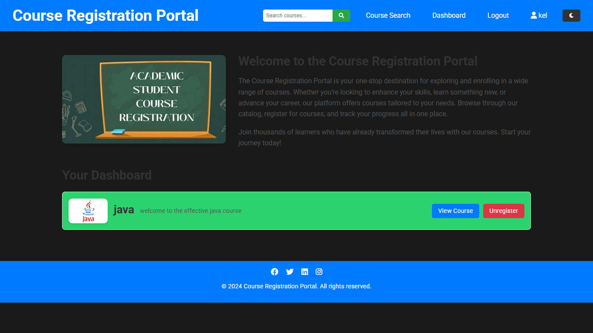

# CourseRegistrationPortal
CourseRegistrationPortal is an online system designed to simplify the course registration process for students and educational institutions. It provides a digital platform where students can browse available courses, select their preferred subjects, and enroll without the hassle of manual paperwork. These portals often incorporate features such as automatic seat allocation, prerequisite verification, and scheduling tools, ensuring a seamless registration experience. Administrators and faculty members can oversee student enrollment, manage course availability, and access real-time registration data to make informed decisions. Some implementations of CourseRegistrationPortal are built using technologies like **DBMS (SQL), PHP**, or **Spring Boot**, integrating database management for efficient record-keeping and offering user-friendly interfaces for both students and faculty. By streamlining enrollment, CourseRegistrationPortal enhances accessibility, improves organization, and optimizes the academic registration process for institutions and learners alike.
# LIVE PREVIEW:

## 🛠️ **Technologies Used**

- **Django**: Web framework for building the project.
- **SQLite**: Default database for the application (can be changed to PostgreSQL or MySQL).
- **HTML/CSS/JS**: Frontend technologies for the user interface.
- **Bootstrap**: Frontend framework for responsive design.

---
